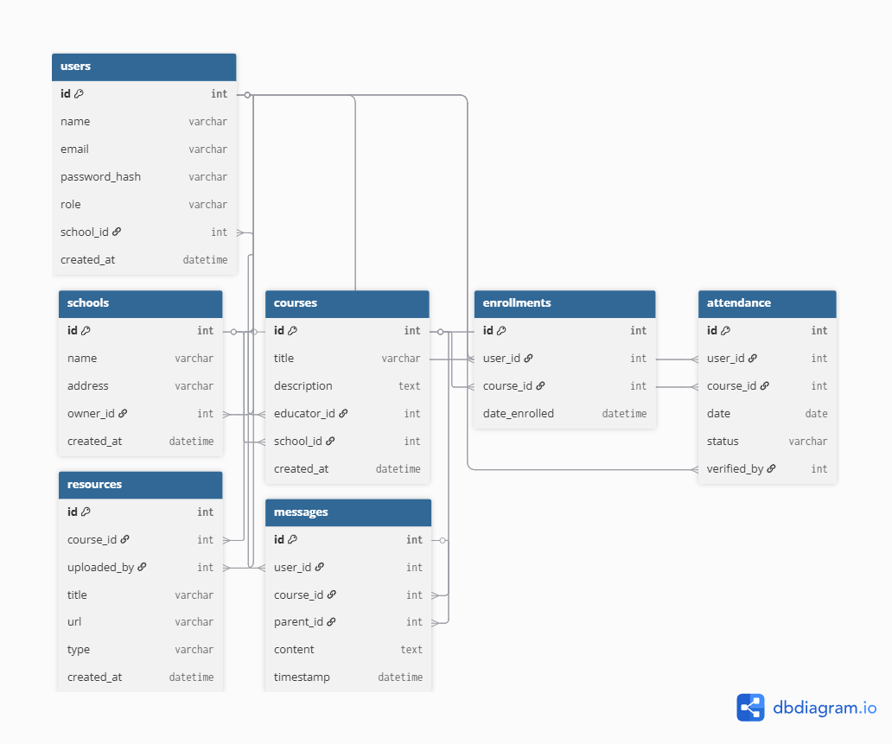

# Database Schema

This document describes the database schema for the **Jifunze Platform**.
It provides an overview of the entities, their attributes, and relationships.

---

## ERD Diagram

---

## Tables

### 1. Users
Represents all users of the platform (students, educators, managers).  
- **id** (int, PK) – Primary key.  
- **public_id** (varchar(50)) – Public unique identifier.  
- **name** (varchar(100)) – User's full name.  
- **email** (varchar(120)) – Unique email address.  
- **password_hash** (varchar(128)) – Hashed password.  
- **role** (enum) – User role (student, educator, manager).  
- **school_id** (int, FK → schools.id) – Reference to the user's school.  
- **created_at** (datetime) – When the user was created.  
- **updated_at** (datetime) – When the user was last updated.  

### 2. Schools
Represents educational institutions on the platform.  
- **id** (int, PK) – Primary key.  
- **name** (varchar(150)) – School name.  
- **address** (varchar(255)) – Physical address.  
- **phone** (varchar(20)) – Contact number.  
- **owner_id** (int, FK → users.id) – School owner/manager.  
- **created_at** (datetime) – When the school was created.  
- **updated_at** (datetime) – When the school was last updated.  

### 3. Courses
Represents courses offered by educators.  
- **id** (int, PK) – Primary key.  
- **title** (varchar(150)) – Course title.  
- **description** (text) – Course description.  
- **educator_id** (int, FK → users.id) – Course instructor.  
- **school_id** (int, FK → schools.id) – School offering the course.  
- **created_at** (datetime) – When the course was created.  
- **updated_at** (datetime) – When the course was last updated.  

### 4. Enrollments
Tracks student enrollments in courses.  
- **id** (int, PK) – Primary key.  
- **user_id** (int, FK → users.id) – Enrolled student.  
- **course_id** (int, FK → courses.id) – Course being enrolled in.  
- **enrolled_at** (datetime) – When the enrollment was created.  
- **status** (varchar(20)) – Enrollment status (active, completed, dropped).  

### 5. Resources
Educational resources uploaded for courses.  
- **id** (int, PK) – Primary key.  
- **title** (varchar(255)) – Resource title.  
- **description** (text) – Resource description.  
- **file_path** (varchar(500)) – Path to the uploaded file.  
- **course_id** (int, FK → courses.id) – Associated course.  
- **uploaded_by** (int, FK → users.id) – User who uploaded the resource.  
- **created_at** (datetime) – When the resource was uploaded.  

### 6. Messages
Communication between users within courses.  
- **id** (int, PK) – Primary key.  
- **content** (text) – Message content.  
- **user_id** (int, FK → users.id) – Sender of the message.  
- **course_id** (int, FK → courses.id) – Associated course.  
- **created_at** (datetime) – When the message was sent.  

### 7. Attendance
Tracks student attendance in courses.  
- **id** (int, PK) – Primary key.  
- **user_id** (int, FK → users.id) – Student being marked.  
- **course_id** (int, FK → courses.id) – Associated course.  
- **date** (date) – Date of attendance.  
- **status** (varchar(20)) – Attendance status (present, absent, late).  
- **verified_by** (int, FK → users.id) – Staff who verified attendance.  
- **verified_at** (datetime) – When attendance was verified.  

### 8. ResetPasswords
Manages password reset tokens.  
- **id** (int, PK) – Primary key.  
- **user_id** (int, FK → users.id) – User requesting reset.  
- **token** (varchar(255)) – Unique reset token.  
- **expires_at** (datetime) – Token expiration time.  
- **is_used** (boolean) – Whether the token has been used.  
- **created_at** (datetime) – When the token was created.  

### 9. Notifications
System notifications for users.  
- **id** (int, PK) – Primary key.  
- **user_id** (int, FK → users.id) – Recipient of the notification.  
- **title** (varchar(255)) – Notification title.  
- **message** (text) – Notification content.  
- **is_read** (boolean) – Whether the notification has been read.  
- **created_at** (datetime) – When the notification was created.  

---

## Relationships

1. **Users**
   - One-to-Many with Schools (owner)
   - One-to-Many with Courses (educator)
   - One-to-Many with Enrollments
   - One-to-Many with Messages
   - One-to-Many with Resources (uploader)
   - One-to-Many with Attendance (as both student and verifier)

2. **Schools**
   - Many-to-One with Users (owner)
   - One-to-Many with Users (members)
   - One-to-Many with Courses

3. **Courses**
   - Many-to-One with Schools
   - Many-to-One with Users (educator)
   - One-to-Many with Enrollments
   - One-to-Many with Resources
   - One-to-Many with Messages
   - One-to-Many with Attendance

4. **Enrollments**
   - Many-to-One with Users (student)
   - Many-to-One with Courses

5. **Resources**
   - Many-to-One with Courses
   - Many-to-One with Users (uploader)

6. **Messages**
   - Many-to-One with Users (sender)
   - Many-to-One with Courses

7. **Attendance**
   - Many-to-One with Users (student)
   - Many-to-One with Courses
   - Many-to-One with Users (verifier)

8. **ResetPasswords**
   - Many-to-One with Users

9. **Notifications**
   - Many-to-One with Users

---

### 2. Users
Stores all users of the system (students, educators, managers).  
- **id** (int, PK) – Unique identifier.  
- **name** (varchar) – User’s full name.  
- **email** (varchar, unique) – User’s email address.  
- **password_hash** (varchar) – Encrypted password.  
- **role** (varchar) – User role (`student`, `educator`, `manager`).  
- **school_id** (int, FK → schools.id) – The school the user belongs to.  
- **created_at** (datetime) – Account creation timestamp.  

---

### 3. Courses
Contains courses created and managed by educators.  
- **id** (int, PK) – Unique identifier.  
- **title** (varchar) – Course title.  
- **description** (text) – Description of the course.  
- **educator_id** (int, FK → users.id) – The educator responsible.  
- **school_id** (int, FK → schools.id) – School offering the course.  
- **created_at** (datetime) – Course creation date.  

---

### 4. Enrollments
Links students to courses (many-to-many).  
- **id** (int, PK) – Unique identifier.  
- **user_id** (int, FK → users.id) – Student enrolled.  
- **course_id** (int, FK → courses.id) – Course enrolled in.  
- **date_enrolled** (datetime) – Enrollment date.  

🔹 **Constraint**: A student can only be enrolled once per course (`UNIQUE(user_id, course_id)`).  

---

### 5. Attendance
Tracks student attendance per course session.  
- **id** (int, PK) – Unique identifier.  
- **user_id** (int, FK → users.id) – Student attending.  
- **course_id** (int, FK → courses.id) – Course attended.  
- **date** (date) – Session date.  
- **status** (varchar) – `present`, `absent`, or `late`.  
- **verified_by** (int, FK → users.id) – Educator verifying attendance.  

🔹 **Constraint**: One record per student per course per day (`UNIQUE(user_id, course_id, date)`).  

---

### 6. Resources
Stores course learning materials.  
- **id** (int, PK) – Unique identifier.  
- **course_id** (int, FK → courses.id) – Related course.  
- **uploaded_by** (int, FK → users.id) – Educator who uploaded.  
- **title** (varchar) – Resource title.  
- **url** (varchar) – Resource link.  
- **type** (varchar) – File type (e.g., `pdf`, `doc`, `video`).  
- **created_at** (datetime) – Upload timestamp.  

---

### 7. Messages
Supports class-based communication.  
- **id** (int, PK) – Unique identifier.  
- **user_id** (int, FK → users.id) – Sender of the message.  
- **course_id** (int, FK → courses.id) – Related course.  
- **parent_id** (int, FK → messages.id, nullable) – For replies (threaded chat).  
- **content** (text) – Message body.  
- **timestamp** (datetime) – Time the message was sent.  

---

## Relationships Overview
- **Schools → Users**: A school has many users.  
- **Schools → Courses**: A school has many courses.  
- **Users → Courses**: An educator can manage many courses.  
- **Users ↔ Enrollments ↔ Courses**: Many-to-many between students and courses.  
- **Users ↔ Attendance ↔ Courses**: Tracks daily participation.  
- **Courses → Resources**: Each course can have many resources.  
- **Users + Courses → Messages**: Users communicate within course contexts.  

---

## Notes
- This schema supports the **MVP features**: school management, user management, resources, attendance, and classroom interaction.  
- Future updates may add **assessments, exams, and co-curricular activities**.  
